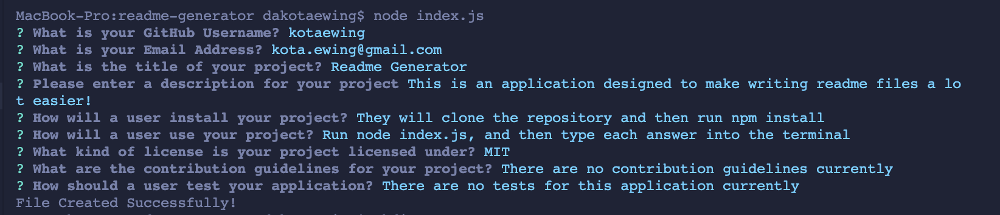

# Readme Generator

## Table of Contents
* [Description](#description)
* [Installation](#installation)
* [Usage](#usage)
* [Contributing](#contributing)
* [Tests](#tests)
* [Questions](#questions)


## Description
This is an application that runs directly in your terminal.  It allows you to quickly and easily create a readme.md file for your project.  Just answer every question, and a high quality readme will be generated.

## Installation
Clone the github repository to your machine, run 'npm install' in the terminal to download the application dependencies, and then youre all set to go

## Usage
To use this application, first run ```node index.js``` in your terminal (make sure you are located in the repository file).  Then, answer each question as they come up.  Type each answer into the terminal, pressing the enter key after each answer.  When the license section comes up, use the arrow keys to navigate between each license, and press enter on your desired license.  If you choose none for the license, no license section will appear in your readme and a license link in the table of contents will also be gone.  Once completed, your README.md file will be created and put into the dist folder of the repository.

Here is a link to the video demonstration: https://youtu.be/ObZxOcIrB1M

## Contributing
Currently, there are no contribution guidelines

## Tests
There is no testing at this point in time

## Questions
If you have any additional questions, you can reach me here:

* GitHub Account - [kotaewing](https://github.com/kotaewing)
* Email Address - kota.ewing@gmail.com
